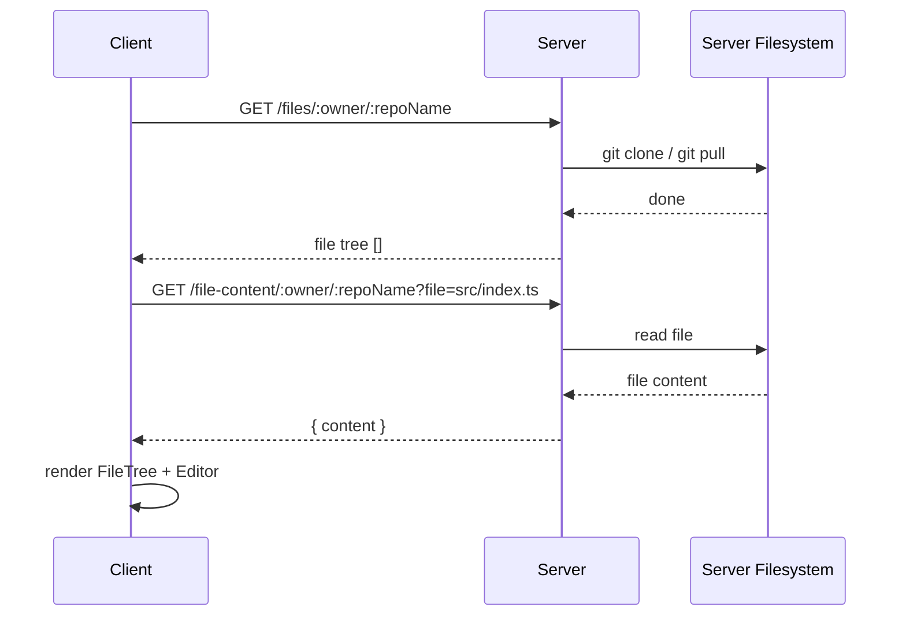

# Pair Programming Terminal

## Setup

```bash
npm run install:all
```

---

## Task (1 hour)

Build a feature that lets the user browse a public GitHub repository in the browser.

1. **Get file tree** — returns the file tree for a repo. Clones or pulls it behind the scenes.
2. **Get file content** — returns the content of a single file from the repo.

The client displays the file tree in the sidebar and opens files in the Monaco editor.

---

## Flow



---

## Endpoints to implement

| Method | Path                                   | Description                                              |
| ------ | -------------------------------------- | -------------------------------------------------------- |
| `GET`  | `/files/:owner/:repoName`              | Clone or pull repo (behind the scenes), return file tree |
| `GET`  | `/file-content/:owner/:repoName?file=` | Return content of a single file                          |
